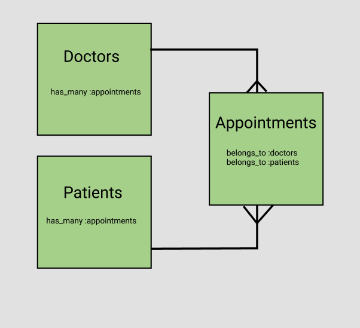
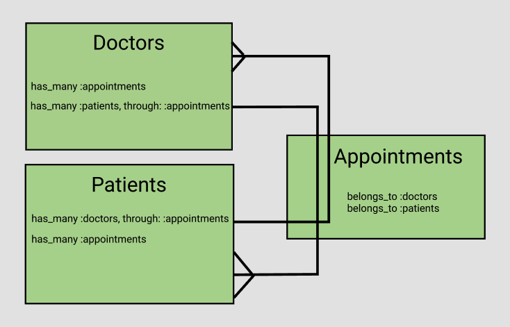

# Rails has_many_through

## Video
[](https://youtu.be/-n9kZXXCiPk)

## Overview
- It is often the case that relationships between models are more complex than just has_many belongs_to.
- If the relationship between two models is such that they both have many and both belong to each other, we can define a third junction model to describe that relationship.

## Learning Objectives
- Create a junction model that defines a relationship for two models in the database

## Vocabulary
- has_many_through


## Has Many Relationships
Think about the relationship between a model called Doctor and a model called Patient. The simplest relationship may be that a doctor has a patient and a patient belongs to a doctor. It is more likely that a doctor will have many patients. We are familiar with that style of relationship, but what if a patient also has many doctors? Then the relationship between our models is a patient has many doctors and a doctor has many patients.

When your models have a more complex association we can use a third model to define the relationship. In our example, it would make sense to have the thing that ties doctors and patients together be appointments. So appointments becomes the third model that is responsible for creating the relationship.

The Appointments model will belong to both the Doctor model and the Patient model and both the Doctor and the Patient model will have many Appointments. Since the Appointments model belongs to both Doctor and Patient, it will hold *both* foreign keys.

```
$ rails g resource Doctor name:string practice:string
$ rails g resource Patient name:string dob:datetime phone:string
$ rails g resource Appointment doctor_id:integer patient_id:integer
```



## Has Many Through
The last part is to create a relationship between Doctors and Patients *through* Appointments. Now a patient can have many doctors and a doctor can have many patients.



[ Back to Syllabus ](../README.md#unit-ten-capstone-project-mvp)
