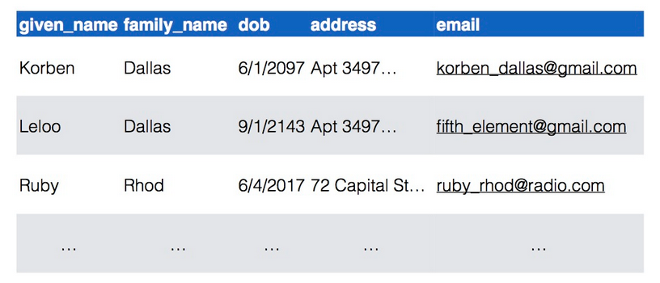
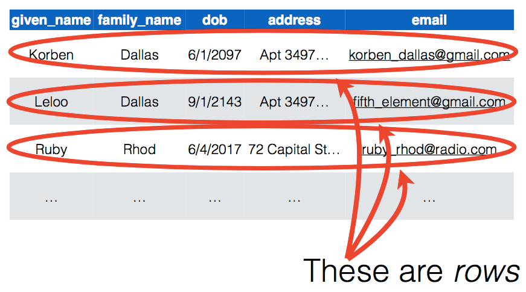

# Introduction to Databases

## Video: Introduction to Databases (2 min)
https://player.vimeo.com/video/137862860

## Overview
- Databases store information in an organized way
- Relational databases store information in tables that consist of rows and columns
- The organizational blueprint of the database is called the schema
- Databases are an essential piece of a full-stack application

## Learning Objectives
- Conceptualize the concept of a relational database
- Recognizing the similarity between database schemas and classes
- Recognizing the similarity between database instances and objects

## Vocabulary
- SQL
- PostgreSQL
- schema
- tables, rows, columns
- relational databases
- database tables
- primary key


### SQL and PostgreSQL
**SQL**, short for Structured Query Language, is a domain-specific language used for communicating with relational databases. **PostgreSQL**, also called just **Postgres**, is one type of SQL. Postgres is an open source object-relational database management system, which means Postgres looks at databases through an object-oriented programming (OOP) lens.

### Relational Databases
A relational database is almost exactly like an Excel spreadsheet or Google Sheets document with information displayed in **rows** and **columns**. A **table** is one set of rows and columns. A database can have many tables that have relationships to each other. The description of the layout of all the tables in a database and the name and data type of each column within each table in a database is called a **schema**.

### How Programs Use Databases
How does the code we write in Rails (or any other language or framework) interact with a database? Let's look at how the information in our programs can be stored in a relational database.

##### Example Information for a Person
```
First Name:     Korben
Last Name:      Dallas
Date of Birth:  6/1/12097
Address:        Apt 3497 1 Main St CityVille, Earth
Email:          korben_dallas@gmail.com
```

Take a look at the information above and imagine how you would write it in code.

Information like this with key:value pairs fits into an object really well. We could put the information above into a Ruby object like this:

```ruby
person1 = {
  "fname" => "Korben",
  "lname" => "Dallas",
  "birthday" => "6/1/1209",
  "address" => "Apt 3497 1 Main St CityVille, Earth",
  "email" => "korben_dallas@gmail.com"
}
```

That works well for storing one person's information, but what if there were going to be many, many people in our app? We would end up with variables like `person10453` with lots of repeated code, no good way to sort the variables, or find common information among them. So, not super helpful. What is a better way to handle this information if we know we will need to keep track of many people?

We can create a `Class`. By making a class for a generic `Person` we get the chance to say what attributes we expect a person to have, and each new person we add will follow that pattern. Adding a class, the code would look like this:

```Ruby
class Person
  def initialize(fname, lname, birthday, address, email)
    @fname = fname
    @lname = lname
    @birthday = birthday
    @address = address
    @email = email
  end
end

Person.new("Korben", "Dallas", "6/1/1209", "Apt 3497 1 Main St CityVille, Earth", "korben_dallas@gmail.com")
```
Now we have a reproducible way to create people in our application. But now we need to store each new instance of class `Person` into a database. (Remember in Ruby, an instance of a class is an object.) How do we do that?

Imagine we are creating an Excel file to store all the objects created from class `Person`. The Excel file would probably be called `people` because it will store info for a bunch of people.

The properties we expect each person to have (first name, last name, birthday, etc... from the list above) would become the columns of our Excel sheet. Adding a new person is a matter of adding a row and filling out that person's information for each column.

That is essentially what will happen in our code. A class will be connected to a database table (the Excel sheet) and each instance of a person will be added to the table as a row.

### Relations or Tables
We now know that a single row entry in a database is an instance of a class somewhere in our code. A collection of instances that contain the same attributes is called a relation or a table.

**Table**


**Collection of instances of class Person**



### The Primary Key
Each row must have a unique way of identifying itself to other parts of the program.

In Rails, every row of a table has a primary key named "id", and that ID is guaranteed to be unique. This prevents problems like two `Person` instances being confused for each other because they have the same name. We can always tell them apart by their ID.

We've added in a primary key for this instance of Person:
```
id:             1
First Name:     Korben
Last Name:      Dallas
Date of Birth:  6/1/12097
Address:        Apt 3497 1 Main St CityVille, Earth
Email:          korben_dallas@gmail.com
```

### Summary
In this lesson, we learned about organizing a program's data into a relational database structure. We were introduced to the database concept of a row, which represents an instance of a class. Rows are grouped together into tables. Relational databases define the name and data type of each column using a schema. One very important attribute of every row in every table in a Rails application is the ID.  Primary keys are guaranteed to be unique, and are how we identify individual rows.

Relational databases were around long before Rails and will be here long after new technologies have take its place. Rails, and all web frameworks, can be thought of as tools to efficiently and securely bridge web pages and data stored in relational databases.

[ Go to next lesson: PostgreSQL Queries ](./queries.md)

[ Back to Syllabus ](../README.md#postgresql)
